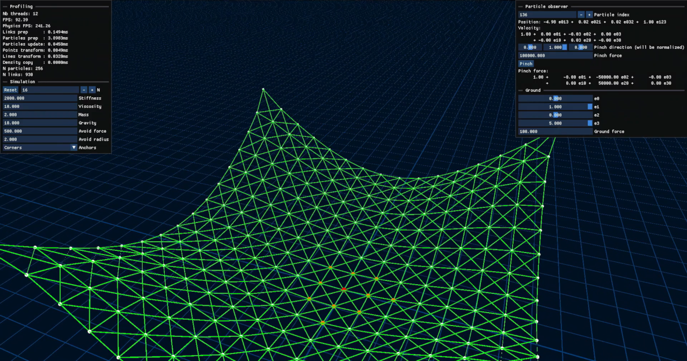

# Spring-based Physics Simulation by means of 3D Projective Geometric Algebra

Vidéo cliquable:  
[](https://youtu.be/neohDCyBGVM)

1. [Explication](#explication)
2. [Compilation](#compilation)
3. [Contenu](#contenu)

## Explication

L'objectif de ce projet est de créer une simulation de masse-ressort, mais en
utilisant l'Algèbre Géométrique Projective en 3D. Pour cela, j'ai utilisé la
librairie [Klein](https://github.com/jeremyong/klein) à la place.

## Compilation

1. Télécharger le repo

```sh
git clone https://github.com/TotoShampoin-IMAC3/algebric-physics-2
git submodule update --init --recursive
```

2. Compiler

```sh
mkdir build
cd build
cmake ..
ninja
cd ..
```

3. Exécuter

```sh
cd out
./physim-pga.exe
```

## Contenu

- Des masses et des ressorts
- Un drap, de taille N x N
- Une figure plane, à force repoussante
- La gravité
- Une force d'anti-collision entre les masses (self collision)
  - Une table de hachage spatial
- Une caméra orbitale
- De la parallélisation
- Une interface utilisateur
  - De la configuration en temps réel
  - La possibilité d'observer les données de chaque masse
  - Un bouton pour infliger une force abrupte sur la masse observée
  - Un bouton pour relancer la simulation

### La simulation

La simulation tourne en temps réel, sur un thread séparé, envoyant les données
sur des buffers qui sont ensuite lus par le thread principal, en charge de
gérer l'affichage et l'interface utilisateur.

L'ensemble des forces appliquées sur les masses par les différents ressorts sont
évaluées en parallèle, grâce à la fonction `std::for_each` avec en argument `std::execution::par_unseq`, comme ci-contre:

```cpp
std::for_each(
    std::execution::par_unseq,
    links.begin(), links.end(),
    [&](auto& link) {
        spring.length = link.length;
        spring.prepareForce(particles[link.a], particles[link.b]);
    }
);
```

### Les masses et les ressorts

L'ensemble du programme est conçus en polymorphisme.

Chaque masse (appelée ici "particule") connait sa position, sa vélocité et sa
masse, mais aussi la force qui lui sera appliquée sur la trame actuelle, afin
d'éviter de fausser le calcul de ces forces et de risquer une instabilité de la
simulation. Une masse peut aussi être bloquée dans l'espace, annulant ainsi
toute force appliquée dessus, et lorsqu'elle se déplace dans l'espace, elle
fournint un événement `onMove`, indiquant son ancienne et sa nouvelle position.

Chaque force appliquée sur les masses hérite d'une classe appelée "lien". La
classe "lien" est une interface qui admet appliquer une force sur une masse, ou
sur deux masses. Un ressort est donc un lien entre deux masses. Une gravité est
un lien sur une masse.

```cpp
// Les masses et les liens
class Particle {
public:
    kln::point position;
    float mass;

    kln::translator velocity {};
    kln::translator force {};
    bool lock {false};

    Event<void(kln::point oldPos, kln::point newPos)> onMove {};

    Particle(const kln::point& position = {}, float mass = 1.f);

    void update(const Second& deltaTime);
    void applyForce(const kln::translator& _force, const Second& deltaTime);
    void prepareForce(const kln::translator& _force);
    void updateForce(const Second& deltaTime);
};
class Link {
public:
    virtual void applyForce(const Second& deltaTime, Particle& p1) = 0;
    virtual void applyForce(
        const Second& deltaTime, Particle& p1, Particle& p2
    ) = 0;

    virtual void prepareForce(Particle& p1) = 0;
    virtual void prepareForce(Particle& p1, Particle& p2) = 0;
};

// Un exemple de lien: Le ressort
class Spring : public Link {
public:
    float length;
    float stiffness;
    float viscosity;

    Spring(float length, float stiffness, float viscosity);

    void applyForce(const Second& deltaTime, Particle& p1) override;
    void applyForce(const Second& deltaTime, Particle& p1, Particle& p2)
        override;

    void prepareForce(Particle& p1) override;
    void prepareForce(Particle& p1, Particle& p2) override;

private:
    kln::translator _calculateForce(Particle& p1, Particle& p2) {
        if (&p1 == &p2)
            throw std::runtime_error("Spring cannot be applied to the same particle"
            );
        float k = stiffness;
        float l0 = length;
        float d = (p1.position & p2.position).norm();
        auto M1M2 = p2.position - p1.position;
        auto dir = M1M2 / d;

        if (d == 0)
            return {};

        auto springForce =
            kln::translator(k * (1 - l0 / d), dir.x(), dir.y(), dir.z());
        auto viscousForce = viscosity * (p2.velocity - p1.velocity);

        return springForce * viscousForce;
    }
};
```

### Spatialisation

Les masses cherchent à se séparer les uns des autres via un autre lien, appelé
"densité". Celui-ci retient l'ensemble des masses dans une table de hachage
spatial, et applique une force en fonction d'une certaine densité calculée à
partir des masses alentours. Ce lien utilise l'événement `onMove` pour
réorganiser les masses dans sa table de hachage.

Il va sans dire que l'estimation des masses alentours à un point reste de loin
l'opération la plus coûteuse de toute la simulation.

```cpp
class Density : public Link {
public:
    Density() = default;
    Density(float repulsionFactor, float lookupRadius, float gridCellSize)
        : repulsionFactor(repulsionFactor),
          lookupRadius(lookupRadius),
          gridCellSize(gridCellSize) {}

    float repulsionFactor = 1.f; // Factor to control the repulsion force
    float lookupRadius = 1.f;    // Radius for looking up particles in the grid
    float gridCellSize = 1.f;    // Size of the grid cell for spatial hashing

    void setParticles(std::vector<Particle>&);
    const std::vector<glm::ivec3>& nearbyCells(const kln::point& p1) const;
    const std::vector<Particle*>& nearbyParticles(const kln::point& p1) const;

    void applyForce(const Second& deltaTime, Particle& p1) override;
    void applyForce(const Second& deltaTime, Particle& p1, Particle& p2)
        override;

    void prepareForce(Particle& p1) override;
    void prepareForce(Particle& p1, Particle& p2) override;

    glm::ivec3 cell(const kln::point& p1) const { return _cell(p1); }
    glm::vec3 cellInSpace(const kln::point& p1) const {
        return glm::vec3(_cell(p1)) * gridCellSize;
    }
    glm::vec3 cellInSpace(const glm::ivec3& c) const {
        return glm::vec3(c) * gridCellSize;
    }

private:
    using uint = unsigned int;
    std::unordered_multimap<glm::ivec3, Particle*> _particleMap {};

    mutable std::vector<glm::ivec3> _cellCache;
    mutable std::vector<Particle*> _particleCache;

    kln::translator _calculateForce(const Particle& p1) const;

    glm::ivec3 _cell(const kln::point& p1) const;
    glm::ivec3 _cell(const Particle& p1) const;
};
```

## Difficultés rencontrées

### La algèbre géométrique

Du fait que j'utilise l'algèbre géométrique, il y a des fonctions que je ne
peux pas avoir aussi facilement qu'avec l'algèbre linéaire.

Par exemple, pour calculer la distance entre deux points, je ne peux pas juste
appliquer le théorème de Pythagore sur la différence. Je dois à la place
calculer la jointure entre deux points, ce qui forme une ligne, puis je dois
calculer la norme de cette ligne. C'est strictement équivalent, mais comme on
utilise l'abstraction de l'algèbre géométrique, on doit faire l'opération la
plus longue.

$$
\begin{aligned}
p_1 &= [ x_1, y_1, z_1 ] \\
p_2 &= [ x_2, y_2, z_2 ] \\
P_1 &= e_{032} x_1 + e_{013} y_1 + e_{021} z_1 + e_{123} \\
P_2 &= e_{032} x_2 + e_{013} y_2 + e_{021} z_2 + e_{123} \\
& \lVert P_1 \vee P_2 \rVert = \sqrt{\left< p_1 , p_2 \right>}
\end{aligned}
$$

Aussi, parce que les composants de klein ne sont pas forcément stockés de la
même manière que les composants de glm, par précaution, j'ai dû convertir tous
les nombres de kleins en nombres de glm.

D'une manière générale, klein s'occupe de la physique, et glm s'occupe de
l'interface et l'affichage.

### Divergence

Du fait que la simulation est faite en temps réelle, elle dépend complètement
de ce que l'ordinateur est capable de calculer en un temps très court.
Autrement dit, la stabilité de la simulation dépend directement de ses
performances. Une grande partie du travail a donc été d'optimiser le programme.
C'est pourquoi j'utilise une table de hachage sur les particules, c'est pourquoi
j'utilise aussi intensément la parallélisation, c'est aussi pourquoi j'utilise
l'instanciation pour dessiner les masses et les ressorts, et c'est également
pourquoi la physique existe sur son propre thread.

### Le parallélisme

Et un challenge qui vient fatalement avec le multi-threadé est la gestion de la
mémoire, et les race-conditions. En effet, comme je dois à la fois modifier et
afficher les masses et les ressorts, et comme il se peut parfois que leurs
décomptes change d'un instant à l'autre, je me dois d'utiliser les mutex.
Le fait est que j'ai mis longtemps à enfin comprendre qu'un mutex n'est
efficace que si tout programme cherchant à utiliser la mémoire qu'il protège
se doit de consulter ledit mutex. Donc, j'ai fais face à quelques segfaults
lors de l'implémentation du parallélisme.

## Conclusion

Je suis assez content de ce que j'ai produit, et surtout de ce que j'ai appris.
Et même, si je compte poursuivre mes études vers un doctorat, je pense que je
voudrais m'orienter dans le monde du rendu graphique, ou dans le monde de la simulation... Ou les deux.
